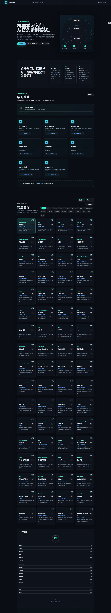
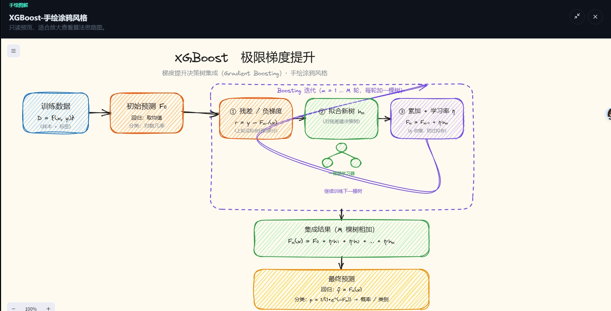

# 机器学习算法学习平台

一个交互式的机器学习算法学习平台，帮助用户系统化学习和理解各类机器学习算法。

## 项目简介

本项目是一个基于 React + TypeScript + Vite 构建的现代化 Web 应用，提供：

- 📚 **算法库展示**：涵盖监督学习、无监督学习、深度学习、集成学习等多个领域的算法
- 🎯 **分类筛选**：按算法类型、应用场景、难度等维度快速查找
- 📊 **算法关系图**：可视化展示算法之间的关联关系
- 🗺️ **学习路线**：提供结构化的学习路径规划
- 🎨 **手绘风格图解**：每个算法都配有手绘涂鸦风格的原理图
- 💡 **详细说明文档**：100+ 篇算法详解文档

## 功能展示

### 首页 - 算法总览


### 算法详情 - XGBoost


### 算法原理图 - XGBoost 极限梯度提升


## 技术栈

- **前端框架**: React 18
- **开发语言**: TypeScript
- **构建工具**: Vite 5
- **UI 组件**: Lucide React (图标)
- **图表库**: ReactFlow (关系图可视化)
- **搜索引擎**: Fuse.js (模糊搜索)
- **绘图工具**: Excalidraw (手绘风格图表)
- **测试框架**: Vitest

## 快速开始

### 安装依赖

```bash
npm install
# 或使用国内镜像
npm run ii
```

### 启动开发服务器

```bash
npm run dev
```

访问 http://127.0.0.1:5173 查看应用

### 构建生产版本

```bash
npm run build
```

### 运行测试

```bash
npm run test        # 交互式测试
npm run test:run    # 单次运行测试
```

## 项目结构

```
learn-ml/
├── src/
│   ├── components/       # React 组件
│   │   ├── layout/      # 布局组件
│   │   └── sections/    # 页面区块组件
│   ├── data/            # 算法数据和配置
│   │   └── algorithms/  # 各类算法定义
│   ├── hooks/           # 自定义 React Hooks
│   ├── utils/           # 工具函数
│   └── styles/          # 样式文件
├── docs/
│   └── 详细说明/         # 算法详解文档（100+ 篇）
├── 图片/                 # 手绘算法原理图（60+ 张）
└── tests/               # 测试文件
```

## 算法覆盖范围

### 监督学习
- 线性回归、逻辑回归、多项式回归、正则化回归
- 决策树、随机森林、梯度提升树
- 支持向量机 (SVM)
- K近邻 (KNN)
- 朴素贝叶斯

### 无监督学习
- K-Means、DBSCAN、层次聚类、高斯混合模型
- 主成分分析 (PCA)、ICA、t-SNE、UMAP
- 孤立森林、局部离群因子 (LOF)、单类 SVM

### 深度学习
- CNN、RNN、LSTM、GRU
- Transformer、BERT、ViT
- U-Net、YOLO、Faster R-CNN
- GAN、自编码器
- 图神经网络 (GNN)

### 集成学习
- XGBoost、LightGBM、CatBoost
- AdaBoost、Stacking、Extra Trees

### 应用领域
- NLP（文本分类、实体识别、关系抽取、机器翻译）
- 计算机视觉（目标检测、图像分割、OCR）
- 时间序列（ARIMA、Prophet、时序Transformer）
- 推荐系统、强化学习、因果推断
- 医疗场景（生存分析、疾病预测、影像分析）

## 特色功能

1. **算法对比**: 支持多个算法的横向对比
2. **进度跟踪**: 记录学习进度和已掌握的算法
3. **关系图谱**: 可视化展示算法之间的演进关系
4. **快捷键支持**: 提供键盘快捷键提升操作效率
5. **主题切换**: 支持亮色/暗色主题
6. **模糊搜索**: 快速定位目标算法

## 贡献指南

欢迎提交 Issue 和 Pull Request！

## 开发说明

- 项目遵循 TypeScript 严格模式
- 使用 ESLint 和 Prettier 保证代码质量
- 组件采用函数式组件 + Hooks 模式
- 样式使用原生 CSS + CSS 变量实现主题切换

## 许可证

MIT License

---

**开始你的机器学习算法学习之旅吧！** 🚀
