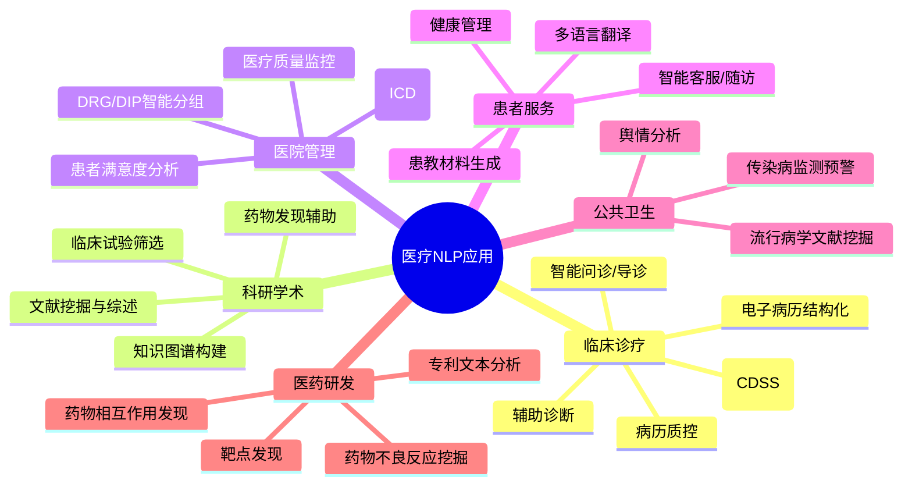
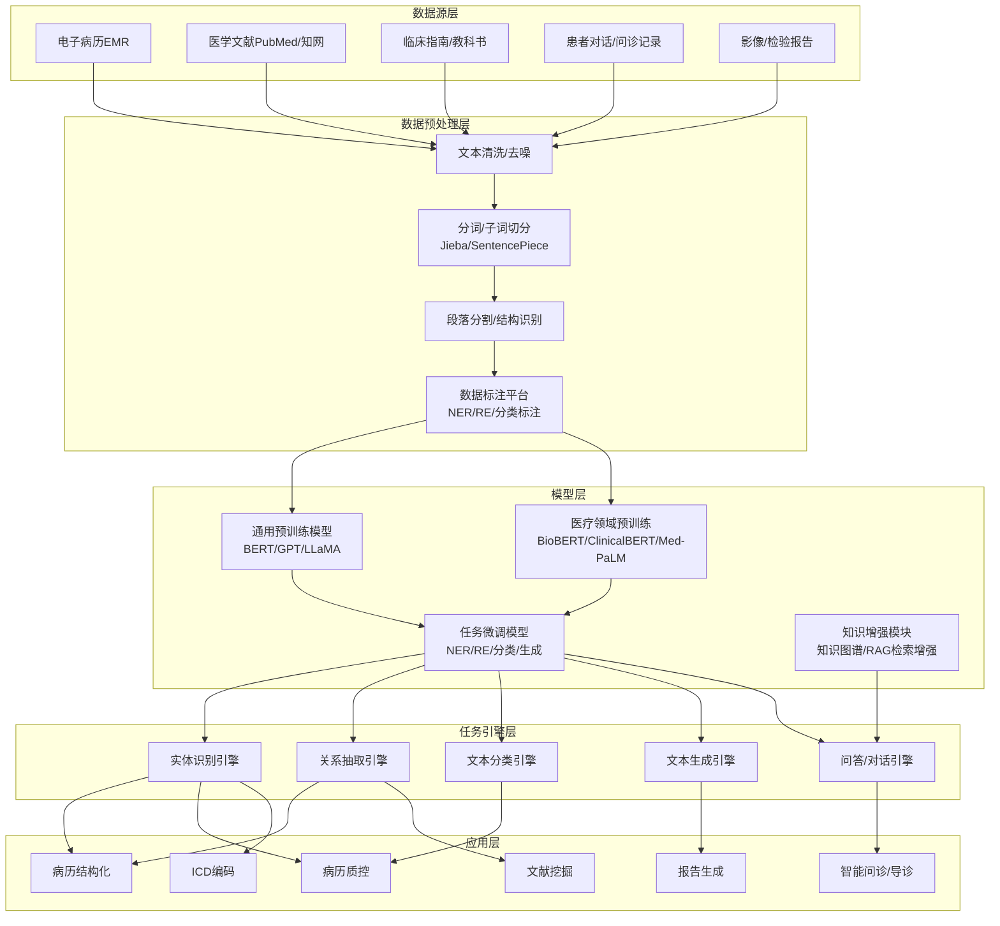
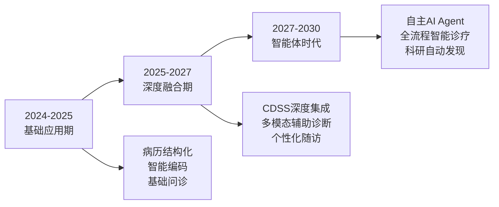

# NLP（自然语言处理）深度分析报告——结合医疗行业

> 本报告系统梳理NLP的技术本质、核心任务、技术演进、医疗场景落地全链路，并给出架构图与未来趋势研判。

---

## 目录

1. [NLP到底是什么](#一nlp到底是什么)
2. [NLP核心技术栈](#二nlp核心技术栈)
3. [NLP关键任务与方法论](#三nlp关键任务与方法论)
4. [NLP技术演进史](#四nlp技术演进史)
5. [医疗行业NLP应用全景](#五医疗行业nlp应用全景)
6. [医疗NLP核心技术架构](#六医疗nlp核心技术架构)
7. [医疗NLP落地挑战与对策](#七医疗nlp落地挑战与对策)
8. [未来趋势研判](#八未来趋势研判)
9. [总结](#九总结)

---

## 一、NLP到底是什么

### 1.1 一句话定义

**自然语言处理（Natural Language Processing, NLP）是让计算机"读懂"人类语言、并据此执行任务的一整套技术体系。**

它不是某一个算法，而是一个**跨学科领域**，融合了：

| 学科 | 贡献 |
|------|------|
| 语言学 | 语法、语义、语用规则 |
| 计算机科学 | 算法设计、系统架构 |
| 统计学/概率论 | 语言模型、概率推理 |
| 深度学习 | 神经网络表示学习 |
| 认知科学 | 人类语言理解机制的模拟 |

### 1.2 NLP的核心矛盾

NLP要解决的根本问题是：**人类语言是模糊的、上下文依赖的、充满歧义的；而计算机需要精确的、结构化的、可计算的表示。**

举例（医疗场景）：

```
"患者3天前出现胸痛，伴左上肢放射痛，含服硝酸甘油后缓解。"

人类理解：典型心绞痛症状描述
NLP需要解决：
  - "3天前" → 时间实体（发病时间）
  - "胸痛" → 症状实体
  - "左上肢放射痛" → 症状实体 + 部位 + 性质
  - "含服硝酸甘油" → 用药实体 + 给药途径
  - "缓解" → 转归关系（用药→症状改善）
  - 整体推理：提示冠心病/心绞痛诊断
```

### 1.3 NLP vs 传统文本处理

| 维度 | 传统文本处理（正则/规则） | NLP |
|------|--------------------------|-----|
| 核心思路 | 模式匹配、关键词检索 | 语义理解、上下文推理 |
| 泛化能力 | 差，新表述无法覆盖 | 强，能理解未见过的表达 |
| 对标注数据依赖 | 无 | 有（监督学习）或无（预训练+提示） |
| 处理模糊性 | 无法处理 | 可建模消歧 |
| 典型工具 | 正则表达式、Lucene | BERT、GPT、spaCy、HanLP |

### 1.4 NLP在AI版图中的位置

```
人工智能 (AI)
├── 感知智能（看、听）
│   ├── 计算机视觉 (CV)
│   └── 语音识别 (ASR)
├── 认知智能（理解、推理）  ← NLP 在这里
│   ├── 自然语言理解 (NLU)
│   ├── 自然语言生成 (NLG)
│   └── 知识推理
└── 运动智能（执行）
    └── 机器人控制
```

**NLP是认知智能的核心技术，是AI从"感知"走向"理解"的关键桥梁。**

---

## 二、NLP核心技术栈

### 2.1 技术分层架构

```
┌─────────────────────────────────────────────┐
│              应用层 Application              │
│  智能问诊 / 病历质控 / 文献挖掘 / 报告生成    │
├─────────────────────────────────────────────┤
│              任务层 Task                     │
│  NER / RE / 分类 / 生成 / QA / 翻译          │
├─────────────────────────────────────────────┤
│              模型层 Model                    │
│  BERT / GPT / LLaMA / 医疗大模型             │
├─────────────────────────────────────────────┤
│              表示层 Representation           │
│  Word2Vec / ELMo / Transformer编码器         │
├─────────────────────────────────────────────┤
│              基础层 Foundation               │
│  分词 / 词性标注 / 句法分析 / 依存解析        │
└─────────────────────────────────────────────┘
```

### 2.2 各层核心技术

#### 基础层——文本预处理

| 技术 | 作用 | 医疗示例 |
|------|------|----------|
| 分词 (Tokenization) | 将文本切分为最小语义单元 | "冠状动脉粥样硬化性心脏病" → 分词/子词 |
| 词性标注 (POS Tagging) | 标注每个词的语法角色 | "头痛"(名词/症状) "加重"(动词/变化) |
| 命名实体识别 (NER) | 识别专有名词 | "阿司匹林"(药物)、"心内科"(科室) |
| 依存句法分析 | 分析词与词之间的语法关系 | "服用" → "阿司匹林"(宾语关系) |
| 分句/分段 | 将长文本切分为句子或段落 | 将入院记录按主诉、现病史、既往史分段 |

#### 表示层——文本向量化

将文本转换为计算机可计算的数值向量：

| 方法 | 原理 | 特点 |
|------|------|------|
| One-Hot | 每个词一个独立维度 | 维度灾难，无法表示语义关系 |
| Word2Vec (CBOW/Skip-gram) | 上下文预测，分布式表示 | 能捕获词相似性，但一词一向量 |
| ELMo | 双向LSTM生成上下文相关向量 | 解决多义词问题 |
| BERT Embedding | Transformer双向编码 | 深度上下文理解，当前主流 |
| 医疗预训练向量 | 在医疗语料上预训练 | BioBERT、PubMedBERT、MC-BERT |

#### 模型层——核心引擎

| 模型 | 类型 | 代表作 | 特点 |
|------|------|--------|------|
| 编码器 (Encoder-only) | 理解型 | BERT、BioBERT、ClinicalBERT | 擅长文本理解任务（分类、NER） |
| 解码器 (Decoder-only) | 生成型 | GPT系列、LLaMA、GLM | 擅长文本生成（对话、报告） |
| 编解码器 (Encoder-Decoder) | 序列转换 | T5、BART | 擅长翻译、摘要、改写 |
| 医疗大模型 | 多种 | Med-PaLM、华佗、灵医大模型 | 医疗领域知识增强 |

#### 任务层——NLP的六大核心任务

| 任务 | 目标 | 医疗应用 |
|------|------|----------|
| 文本分类 | 将文本归入预定义类别 | 诊断分类、科室分流、病历质控 |
| 序列标注 | 为每个token打标签 | NER（实体识别）、词性标注 |
| 关系抽取 | 识别实体间关系 | 药物-疾病关系、症状-诊断关系 |
| 事件抽取 | 识别事件及参与者 | 不良反应事件、手术事件 |
| 文本生成 | 生成新文本 | 影像报告生成、出院小结 |
| 问答/对话 | 根据问题生成答案 | 智能问诊、医学知识查询 |

---

## 三、NLP关键任务与方法论

### 3.1 命名实体识别（NER）

> **从文本中识别并分类特定类型的实体。**

医疗NER的实体类型：

| 实体类型 | 示例 |
|----------|------|
| 疾病/诊断 | "2型糖尿病"、"冠状动脉粥样硬化性心脏病" |
| 症状/体征 | "头痛"、"体温38.5℃"、"呼吸急促" |
| 药物 | "阿司匹林"、"头孢曲松钠" |
| 检查/检验 | "血常规"、"心电图"、"CT" |
| 手术/操作 | "冠脉支架植入术"、"胃镜检查" |
| 解剖部位 | "左冠状动脉前降支"、"胃窦部" |
| 时间 | "3天前"、"术后第2天" |
| 数值/指标 | "血压160/95mmHg"、"血糖12.3mmol/L" |

方法演进：
```
规则/词典匹配 → CRF → BiLSTM-CRF → BERT-CRF → BERT-BiLSTM-CRF → 大模型Prompt
```

### 3.2 关系抽取（RE）

> **识别两个实体之间的语义关系。**

医疗关系类型：

| 关系类型 | 示例 |
|----------|------|
| 药物-适应症 | 阿司匹林 → 预防 → 心肌梗死 |
| 药物-不良反应 | 头孢曲松 → 导致 → 过敏性休克 |
| 症状-疾病 | 胸痛 → 提示 → 心绞痛 |
| 疾病-检查 | 肺栓塞 → 确诊依靠 → CTPA |
| 手术-并发症 | 甲状腺切除术 → 可能引起 → 声音嘶哑 |

### 3.3 文本分类

> **将整段文本映射到预定义的类别。**

| 分类维度 | 医疗示例 |
|----------|----------|
| 诊断分类 | 根据主诉和病史分类：心血管/呼吸/消化/神经... |
| 严重程度 | 轻/中/重度，Ⅰ/Ⅱ/Ⅲ/Ⅳ级 |
| 质控标签 | 病历是否规范、是否缺失关键信息 |
| 科室分流 | 根据症状描述推荐就诊科室 |
| 情感分析 | 患者评价情感倾向（正向/负向/中性） |

### 3.4 文本生成

> **根据输入条件生成新的文本内容。**

医疗生成场景：
- **影像报告生成**：输入影像特征，生成结构化报告
- **出院小结生成**：汇总住院过程，自动生成出院小结
- **患者教育材料**：将专业术语转化为通俗语言
- **随访对话**：生成个性化的随访问题和健康建议

### 3.5 问答与对话

> **理解用户问题，检索或生成准确答案。**

| 类型 | 技术 | 医疗场景 |
|------|------|----------|
| 抽取式QA | 从给定文档中抽取答案 | 基于临床指南回答医生问题 |
| 生成式QA | LLM直接生成答案 | 智能问诊、健康咨询 |
| 知识图谱QA | 将问题转化为SPARQL查询 | 药物相互作用查询 |
| 多轮对话 | 对话状态追踪+策略管理 | 预问诊、慢病随访 |

---

## 四、NLP技术演进史

### 4.1 四个时代

```
时代1：规则时代（1950s-1990s）
  手写语法规则 + 词典 + 正则表达式
  代表：专家系统、SHRDLU
  医疗：ICD编码规则引擎

时代2：统计机器学习时代（1990s-2012）
  HMM / CRF / SVM / 最大熵
  代表：N-gram语言模型、TF-IDF
  医疗：基于CRF的医学NER

时代3：深度学习时代（2013-2017）
  Word2Vec / LSTM / Attention / Seq2Seq
  代表：BiLSTM-CRF序列标注、Seq2Seq翻译
  医疗：基于LSTM的病历文本分类

时代4：预训练大模型时代（2018-至今）
  Transformer → BERT → GPT → LLaMA → 医疗大模型
  代表：BioBERT、ClinicalBERT、Med-PaLM、ChatGPT
  医疗：大模型驱动的智能问诊、病历生成、辅助诊断
```

### 4.2 关键里程碑

| 时间 | 里程碑 | 意义 |
|------|--------|------|
| 1950 | 图灵测试提出 | 确立"机器能否理解语言"的根本问题 |
| 1954 | Georgetown实验 | 首次机器翻译演示 |
| 1997 | LSTM提出 | 解决长序列建模问题 |
| 2003 | NPLM（神经概率语言模型） | 开启神经网络语言模型时代 |
| 2013 | Word2Vec发布 | 词向量成为NLP基础设施 |
| 2014 | Seq2Seq + Attention | 端到端序列建模，奠定翻译/生成基础 |
| 2017 | Transformer发表 | "Attention is All You Need"，革命性架构 |
| 2018 | BERT发布 | 预训练+微调范式，刷新11项NLP基准 |
| 2018 | BioBERT发布 | NLP预训练进入医疗垂直领域 |
| 2019 | GPT-2 | 大模型生成能力引起关注 |
| 2020 | GPT-3 (175B) | Few-shot learning，提示工程兴起 |
| 2022 | ChatGPT发布 | 大模型走向通用对话，引发全球关注 |
| 2023 | Med-PaLM 2 | 医疗大模型达到专家医师水平（USMLE 86.5%） |
| 2024-2025 | 医疗多模态大模型 | 文本+影像+时序融合，推动临床落地 |

### 4.3 范式转变

```
旧范式：任务专用模型
  为每个NLP任务收集标注数据 → 训练专用模型 → 部署

新范式：预训练 + 提示 + 微调
  大规模无标注语料预训练 → 少量标注数据微调/提示 → 部署

医疗新范式：
  医疗通用大模型预训练 → 医疗任务适配（NER/RE/QA）→ 临床场景部署
```

---

## 五、医疗行业NLP应用全景

### 5.1 应用总览图



### 5.2 场景详解

#### 场景一：电子病历结构化

> **将自由文本的病历内容转化为结构化、可计算的数据。**

**痛点**：
- 全国超过80%的临床信息以非结构化文本形式存在于病历中
- 医生书写风格各异，简写、缩写、口语化表达普遍
- 后续科研、质控、管理需要结构化数据

**NLP处理流程**：

```
原始病历文本
  ↓ 分段（主诉/现病史/既往史/...）
  ↓ 分句
  ↓ 分词
  ↓ 命名实体识别（NER）
  ↓ 关系抽取（RE）
  ↓ 事件抽取
  ↓ 时序归一化（"3天前" → 2026-04-18）
  ↓ 否定检测（"无胸痛" → 排除）
  ↓ 结构化输出（JSON/数据库）
```

**示例**：

输入文本：
```
"患者男性，65岁，因'反复胸闷气促3年，加重伴双下肢水肿1周'入院。
既往有高血压病史10年，规律服用氨氯地平5mg qd。
否认糖尿病、冠心病史。"
```

NLP输出（JSON）：
```json
{
  "demographics": {"gender": "男", "age": 65},
  "chief_complaint": {
    "symptoms": [
      {"name": "胸闷", "duration": "3年", "course": "反复"},
      {"name": "气促", "duration": "3年", "course": "反复"},
      {"name": "双下肢水肿", "duration": "1周", "course": "加重"}
    ]
  },
  "past_history": [
    {"disease": "高血压病", "duration": "10年", "medication": "氨氯地平", "dose": "5mg", "frequency": "qd"}
  ],
  "negation": ["糖尿病", "冠心病"]
}
```

**核心技术**：
- BERT-CRF / ClinicalBERT-CRF（实体识别）
- CasRel / TPLinker（关系抽取）
- 否定检测模型
- 时序归一化
- 规则+模型混合策略

#### 场景二：智能问诊与导诊

> **通过多轮对话收集患者症状信息，给出就诊建议。**

**技术链路**：

```
患者输入（语音/文本）
  ↓ ASR语音识别（如为语音）
  ↓ NLU理解（意图识别 + 槽位提取）
  ↓ 对话状态追踪（DST）
  ↓ 对话策略（DP）→ 追问/确认/推荐
  ↓ NLG生成回复
  ↓ 分诊推荐（科室/紧急程度）
```

**核心能力**：
| 能力 | 说明 |
|------|------|
| 症状识别 | 从患者描述中提取症状实体 |
| 追问推理 | 根据已有症状，推断需要追问的方向 |
| 严重度评估 | 判断病情紧急程度 |
| 科室推荐 | 映射症状到对应科室 |
| 就医建议 | 是否需要立即就医、建议检查项目 |

**示例对话**：

```
系统：您好，请问有什么不舒服的？
患者：我最近一直头痛，有时候还会恶心。
系统：头痛持续多长时间了？是哪个部位痛？
  → NLU：识别症状"头痛"、"恶心"，触发神经内科问诊路径
患者：大概一个星期了，两边太阳穴那边跳着痛。
系统：有没有发烧？视力有没有变化？
  → 推理：需排除颅内压增高、感染性病因
患者：没有发烧，视力好像有点模糊。
系统：根据您的症状描述，建议您尽快前往【神经内科】就诊，
      可能需要进行头颅CT或MRI检查。
      症状评分：中紧急度（建议48小时内就诊）
```

#### 场景三：病历质控

> **自动检查病历书写的规范性、完整性和一致性。**

| 质控维度 | NLP任务 | 示例 |
|----------|---------|------|
| 完整性检查 | 信息抽取 + 缺失检测 | 诊断是否有对应的病史支撑 |
| 一致性检查 | 交叉验证 | 主诉与现病史是否矛盾 |
| 时限性检查 | 时序归一化 | 首次病程记录是否在8小时内完成 |
| 规范性检查 | 文本分类 | 是否使用规范医学术语 |
| 诊断合理性 | 知识图谱推理 | 诊断与症状/检查是否匹配 |

#### 场景四：ICD编码与DRG/DIP

> **自动将诊断和手术信息映射到标准编码，支持医保支付分组。**

```
医生书写的诊断文本
  ↓ NLP实体识别（诊断名称）
  ↓ 语义匹配（与ICD-10标准库对齐）
  ↓ 编码推荐（Top-N候选）
  ↓ 人工确认/修正
  ↓ 输出ICD编码
  ↓ DRG/DIP分组器
  ↓ 医保支付分组结果
```

**难点**：
- 同一诊断多种表述（"冠心病" = "冠状动脉粥样硬化性心脏病" = "CHD"）
- 编码粒度差异（ICD-10亚目编码极细）
- 并发症/合并症识别影响分组

#### 场景五：医学文献挖掘与知识图谱

> **从海量医学文献中自动提取知识，构建结构化知识库。**

**知识图谱构建流程**：

```
PubMed/万方/知网文献
  ↓ PDF解析 + 正文提取
  ↓ 文本分段（摘要/方法/结果/结论）
  ↓ 实体识别（疾病/基因/药物/通路）
  ↓ 关系抽取（药物-靶点、基因-疾病、药物-药物）
  ↓ 事件抽取（药物临床试验事件、不良反应事件）
  ↓ 知识融合（实体对齐、冲突消解）
  ↓ 知识图谱存储（Neo4j/图数据库）
  ↓ 上层应用（QA、推荐、发现）
```

**典型应用**：
| 应用 | 价值 |
|------|------|
| 药物相互作用预警 | 自动发现文献中报道的药物联用风险 |
| 罕见病辅助诊断 | 将患者症状与文献中罕见病描述匹配 |
| 临床指南自动更新 | 持续追踪最新研究证据 |
| 药物新适应症发现 | 文献中挖掘药物的off-label使用线索 |

#### 场景六：医疗报告自动生成

> **根据输入数据（影像特征、检验结果等）自动生成结构化医疗报告。**

| 报告类型 | 输入 | 输出 |
|----------|------|------|
| 影像报告 | CT/MRI/X光影像特征 | 结构化影像诊断报告 |
| 病理报告 | WSI图像特征 | 病理诊断描述 |
| 出院小结 | 住院全过程数据 | 出院记录 |
| 手术记录 | 手术视频分析+器械使用记录 | 手术过程描述 |
| 会诊意见 | 患者资料+专科知识 | 会诊建议 |

---

## 六、医疗NLP核心技术架构

### 6.1 整体架构图



### 6.2 医疗NLP技术选型矩阵

| 任务 | 小数据场景 (<1k标注) | 中等数据 (1k-10k) | 大数据场景 (>10k) |
|------|---------------------|-------------------|-------------------|
| NER | BioBERT + Few-shot + 规则辅助 | ClinicalBERT-CRF 微调 | BERT-BiLSTM-CRF 全量训练 |
| 关系抽取 | Prompt + GPT API | CasRel / TPLinker 微调 | 大规模RE预训练模型 |
| 文本分类 | Prompt / LoRA微调 | BERT-Classifier 微调 | Fine-tune + 知识蒸馏 |
| 文本生成 | 医疗大模型 + Prompt | 医疗大模型 + LoRA | 全参数微调医疗LLM |
| 问答 | RAG + 知识图谱 | 检索增强生成 (RAG) | 医疗LLM + RLHF |

### 6.3 医疗NLP数据标注规范

标注质量直接决定模型上限，医疗标注需要：

| 要求 | 说明 |
|------|------|
| 标注员资质 | 需要医学背景，理想为临床医师 |
| 标注规范 | 详细的标注指南（Bracketing Guidelines） |
| 一致性检验 | 多人标注 → Cohen's Kappa ≥ 0.8 |
| 迭代优化 | 定期讨论分歧案例，更新标注规范 |
| 工具支持 | Doccano/Label Studio等标注平台 |

---

## 七、医疗NLP落地挑战与对策

### 7.1 六大核心挑战

#### 挑战一：医学语言的复杂性

| 问题 | 示例 | 对策 |
|------|------|------|
| 术语多样性 | "心梗" = "心肌梗死" = "MI" = "Myocardial Infarction" | 医学术语标准化 + 同义词库 |
| 大量缩写 | "BP"(血压)、"PE"(体格检查/肺栓塞)、"DM"(糖尿病) | 缩写消歧模型 + 上下文推理 |
| 否定表达 | "无发热"、"否认胸痛" | 否定检测模型（NegEx / BERT-based） |
| 模糊表达 | "可能"、"考虑"、"不除外"、"待排" | 不确定性标注 + 置信度建模 |
| 倒装/省略 | "予以停用"（省略了药物名） | 依存句法分析 + 共指消解 |

#### 挑战二：标注数据稀缺

| 问题 | 对策 |
|------|------|
| 医学标注成本高（需专业医师） | 主动学习：模型选择最有价值样本标注 |
| 标注数据量少 | 少样本学习（Few-shot）+ Prompt工程 |
| 跨院数据分布差异 | 迁移学习 + 领域自适应 |
| 标注一致性难保证 | 标注规范迭代 + 质量控制流程 |

#### 挑战三：隐私合规

| 法规 | 要求 | 技术对策 |
|------|------|----------|
| 《个人信息保护法》 | 最小化收集、脱敏处理 | 自动脱敏（姓名/身份证/手机号NER + 替换） |
| 《数据安全法》 | 分类分级管理 | 数据分级存储、访问控制 |
| 《人类遗传资源管理条例》 | 基因数据出境限制 | 本地化部署、联邦学习 |
| HIPAA（如涉及国际合作） | PHI保护 | 去标识化、差分隐私 |

#### 挑战四：模型可解释性

| 问题 | 对策 |
|------|------|
| 深度模型是"黑箱" | 注意力可视化、LIME/SHAP解释 |
| 临床决策需要可追溯 | 规则+模型混合架构，关键环节保留规则解释 |
| 医生不信任AI建议 | 置信度展示 + 证据溯源 + 人机协同 |

#### 挑战五：系统集成与部署

| 问题 | 对策 |
|------|------|
| 医院HIS/EMR系统异构 | 标准化接口（HL7 FHIR）+ 适配层 |
| 实时性要求 | 模型轻量化（知识蒸馏/量化）+ 边缘部署 |
| 高可用要求 | 微服务架构 + 容器化 + 弹性扩缩容 |

#### 挑战六：持续维护与迭代

| 问题 | 对策 |
|------|------|
| 医学知识持续更新 | 知识图谱定期更新 + 模型增量训练 |
| 新疾病/新术语出现 | 术语库动态维护 + 持续学习机制 |
| 用户反馈闭环 | 建立标注反馈机制，定期重训模型 |

### 7.2 挑战-对策矩阵总结

```
挑战                      核心对策                         技术手段
──────────────────────────────────────────────────────────────────
医学语言复杂性    →    领域预训练 + 知识增强    →    BioBERT + 知识图谱 + 规则
标注数据稀缺      →    少样本 + 数据增强         →    Prompt + LoRA + 主动学习
隐私合规          →    脱敏 + 本地化 + 联邦学习   →    NER脱敏 + 私有化部署
模型可解释性      →    混合架构 + 可视化         →    规则+模型 + SHAP + 注意力
系统集成          →    标准接口 + 轻量化         →    FHIR + 模型蒸馏 + ONNX
持续维护          →    自动化ML流水线            →    MLOps + 增量训练
```

---

## 八、未来趋势研判

### 8.1 技术趋势

| 趋势 | 说明 | 预计成熟时间 |
|------|------|-------------|
| **医疗大模型** | 专为医疗训练的千亿参数大模型，覆盖诊断、治疗、科研 | 2025-2027 |
| **多模态融合** | 文本+影像+时序+基因数据的统一理解与推理 | 2025-2028 |
| **RAG增强** | 检索增强生成，将权威医学知识实时注入大模型 | 2024-2026 |
| **Agent化** | NLP从单任务工具走向自主决策的AI Agent | 2026-2028 |
| **小模型+知识** | 轻量模型外挂知识图谱，低成本高精度 | 2025-2027 |
| **具身NLP** | NLP与手术机器人、护理机器人结合 | 2028+ |

### 8.2 应用趋势



### 8.3 对医疗机构的建议

| 阶段 | 建议 |
|------|------|
| **近期（1年内）** | ① 电子病历后结构化试点 ② ICD智能编码辅助 ③ 门诊预问诊上线 |
| **中期（1-3年）** | ① CDSS深度集成临床流程 ② 知识图谱平台建设 ③ 医疗大模型私有化部署 |
| **远期（3-5年）** | ① 多模态AI诊疗助手 ② 全院级AI质量管控 ③ 科研智能化平台 |

---

## 九、总结

### NLP的本质

NLP不是某个单一算法，而是**让计算机从"看到文字"到"理解语义"再到"执行任务"的完整技术体系**。它经历了规则→统计→深度学习→大模型四个时代，每一次范式跃迁都极大拓展了能力的边界。

### NLP在医疗的核心价值

```
数据 → 信息 → 知识 → 决策
 │       │       │       │
 结构化  归类整理  关联推理  辅助判断
```

医疗数据80%以上是非结构化文本，NLP是**解锁这些数据价值的关键钥匙**。从病历结构化到辅助诊断，从文献挖掘到药物发现，NLP正在重构医疗信息处理的每一个环节。

### 当前定位

我们正处于"**大模型+医疗垂直场景**"的历史交汇点。通用大模型提供了前所未有的语言理解能力，医疗领域的专业数据、知识图谱和业务场景则为落地提供了坚实基础。**NLP在医疗的大规模落地不是"会不会"的问题，而是"何时"和"如何"的问题。**

---

## 附录：推荐技术栈

| 类别 | 推荐工具/框架 |
|------|--------------|
| 中文分词 | Jieba、HanLP、LAC |
| NLP框架 | Hugging Face Transformers、spaCy、PaddleNLP |
| 医疗预训练模型 | BioBERT、ClinicalBERT、PubMedBERT、MC-BERT |
| 医疗大模型 | Med-PaLM 2、华佗（HuatuoGPT）、灵医大模型、百川医疗 |
| 知识图谱 | Neo4j、Apache Jena、DGL-KE |
| 标注工具 | Doccano、Label Studio、Brat |
| 对话框架 | Rasa、LangChain、LlamaIndex |
| 部署框架 | ONNX Runtime、TensorRT、vLLM |
| 医学术语库 | UMLS、ICD-10/11、SNOMED CT、MeSH |

---

*报告生成时间：2026-04-21*
