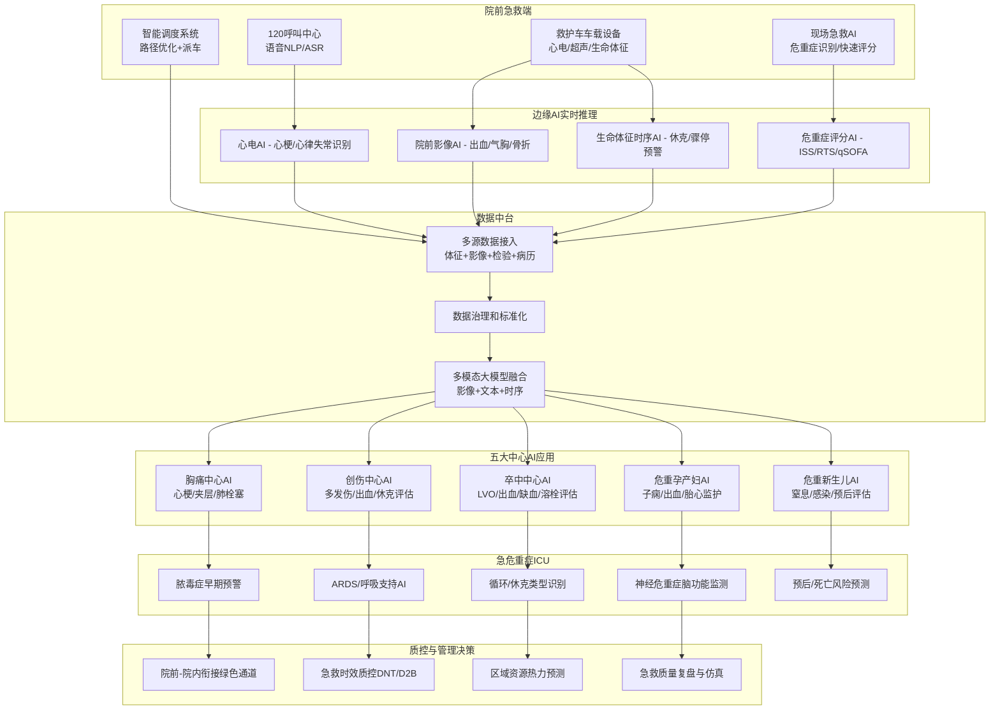
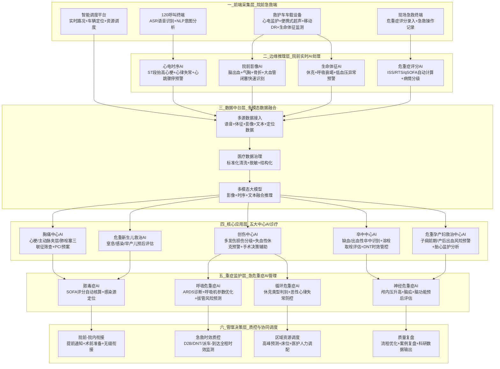

# 医疗中的机器学习算法应用汇总

> 本文档汇总整理医疗场景下机器学习/深度学习算法的应用，覆盖临床、影像、检验、病理、科研、管理等方向。

---

## 目录

1. [医学影像场景](#一医学影像场景)
2. [临床诊疗与风险预测](#二临床诊疗与风险预测)
3. [检验与实验室医学](#三检验与实验室医学)
4. [病理与内镜场景](#四病理与内镜场景)
5. [神经科学/脑科学场景](#五神经科学脑科学场景)
6. [医疗NLP与文本数据场景](#六医疗nlp与文本数据场景)
7. [手术与介入医疗场景](#七手术与介入医疗场景)
8. [公卫与医院管理场景](#八公卫与医院管理场景)
9. [急诊与五大中心场景](#九急诊与五大中心场景)
10. [院前急救场景](#十院前急救场景)
11. [算法速查表](#十一算法速查表)
12. [架构图](#十二架构图)

---

## 一、医学影像场景

### 1. CT/MRI 病灶检测与分割
| 算法 | 场景 |
|------|------|
| CNN、U-Net、Transformer、3D-CNN | 肺结节、脑肿瘤、脑出血、眼底病变、肝脏肿瘤分割 |

### 2. X光胸片智能诊断
| 算法 | 场景 |
|------|------|
| ResNet、EfficientNet、多标签分类 | 肺炎、结核、气胸、心影增大筛查 |

### 3. 超声AI辅助诊断
| 算法 | 场景 |
|------|------|
| 时序模型、分割网络 | 甲状腺结节良恶性、乳腺超声、胎儿发育评估 |

### 4. 病理切片全切片分析（WSI）
| 算法 | 场景 |
|------|------|
| ViT、多实例学习（MIL） | 宫颈癌筛查、乳腺癌分级、前列腺癌诊断 |

---

## 二、临床诊疗与风险预测

### 1. 疾病早期筛查与风险预测
| 算法 | 场景 |
|------|------|
| 逻辑回归、XGBoost、LSTM、Transformer | 糖尿病、高血压、心衰、脓毒症、脑卒中风险 |

### 2. ICU重症预警
| 算法 | 场景 |
|------|------|
| 时序预测、异常检测 | 多器官衰竭预警、低血压预警、呼吸衰竭预警 |

### 3. 个性化治疗推荐
| 算法 | 场景 |
|------|------|
| 推荐系统、生存分析、因果推断 | 肿瘤化疗方案、靶向药选择、抗凝药剂量 |

---

## 三、检验与实验室医学

### 1. 血常规/生化指标异常识别
| 算法 | 场景 |
|------|------|
| 异常检测、分类模型 | 感染判断、肾功能异常、肝功能损伤 |

### 2. 微生物鉴定与药敏预测
| 算法 | 场景 |
|------|------|
| NLP、分类模型 | 细菌/真菌鉴定、抗生素耐药预测 |

### 3. 基因测序数据分析
| 算法 | 场景 |
|------|------|
| 深度学习、变异检测模型 | 肿瘤基因突变检测、遗传病筛查 |

---

## 四、病理与内镜场景

### 1. 胃镜/肠镜AI早癌筛查
| 算法 | 场景 |
|------|------|
| 实时目标检测（YOLO、Faster R-CNN） | 胃癌、结直肠癌、息肉识别与良恶性判断 |

### 2. 细胞学AI判读
| 算法 | 场景 |
|------|------|
| 图像分类、分割 | 宫颈液基细胞学（TCT）、痰细胞学 |

---

## 五、神经科学/脑科学场景

### 1. EEG/ECG信号分析
| 算法 | 场景 |
|------|------|
| CNN+RNN、Transformer、小波变换 | 癫痫检测、睡眠分期、心律失常识别 |

### 2. fMRI脑功能网络分析
| 算法 | 场景 |
|------|------|
| 图神经网络（GNN）、ICA | 抑郁症、精神分裂症、阿尔茨海默病脑区连接异常 |

### 3. 脑肿瘤/脑卒中预后预测
| 算法 | 场景 |
|------|------|
| 多模态融合（影像+临床+基因） | 胶质瘤分级、出血预后、康复效果预测 |

### 4. 神经退行性疾病早期诊断
| 算法 | 场景 |
|------|------|
| 生存分析、时序模型 | 阿尔茨海默症、帕金森病早期识别 |

---

## 六、医疗NLP与文本数据场景

### 1. 电子病历（EMR）信息抽取
| 算法 | 场景 |
|------|------|
| BERT、BiLSTM-CRF | 症状提取、诊断提取、手术史、过敏史结构化 |

### 2. 医学文献挖掘与知识图谱
| 算法 | 场景 |
|------|------|
| 关系抽取、知识图谱构建 | 药物相互作用、罕见病诊断辅助、临床指南更新 |

### 3. 智能问诊/导诊
| 算法 | 场景 |
|------|------|
| 意图识别、对话模型 | 预问诊、分诊、慢病管理随访 |

---

## 七、手术与介入医疗场景

### 1. 手术导航与术中定位
| 算法 | 场景 |
|------|------|
| 3D配准、目标跟踪 | 神经外科导航、骨科穿刺、腹腔镜病灶定位 |

### 2. 手术视频智能分析
| 算法 | 场景 |
|------|------|
| 行为识别、时序模型 | 手术步骤识别、器械识别、失误风险预警 |

---

## 八、公卫与医院管理场景

### 1. 疫情预测与流行趋势
| 算法 | 场景 |
|------|------|
| 时间序列、SEIR模型+机器学习 | 流感、新冠、登革热传播预测 |

### 2. 医院资源调度
| 算法 | 场景 |
|------|------|
| 强化学习、运筹优化 | 床位调度、急诊拥堵预测、手术室排程 |

### 3. 慢病管理与随访
| 算法 | 场景 |
|------|------|
| 聚类、用户画像 | 高血压/糖尿病患者分层管理 |

---

## 九、急诊与五大中心场景

### 1. 急诊整体场景

| 场景 | 算法 | 应用 |
|------|------|------|
| 院前急救智能调度 | 路径优化、时序预测、强化学习 | 120派车、拥堵预测、最近医院推荐 |
| 急诊分诊智能分级 | 分类模型、多维度评分模型 | 自动判断Ⅰ/Ⅱ/Ⅲ/Ⅳ级 |
| 急诊危重症早期预警 | LSTM、XGBoost、异常检测 | 休克预警、呼吸衰竭预警、心跳骤停风险 |
| 急诊检验/心电/影像快速判读 | CNN、时序模型 | 快速识别心梗、脑出血、气胸 |
| 急诊拥挤度预测 | 时间序列、回归模型 | 急诊高峰预测、床位占用预测 |

### 2. 五大中心AI应用

#### 胸痛中心
- 心电图AI自动诊断：ST段抬高、心梗定位、心律失常识别
- 主动脉夹层/肺栓塞CTA智能识别与分割
- 心梗风险评分、D-二聚体AI解读
- 急诊到球囊扩张（D2B）时间智能优化

#### 卒中中心
- CT/MRI快速识别出血、缺血、梗死体积计算
- 大血管闭塞（LVO）AI自动检出
- 卒中发病时间推断、溶栓/取栓评估
- 卒中预后预测、康复效果预测

#### 创伤中心
- 创伤严重度评分（ISS）自动计算
- 多发伤CT快速脏器损伤识别、出血检测
- 休克风险、死亡风险预测模型
- 手术必要性与手术时机智能推荐

#### 危重孕产妇救治中心
- 子痫前期、产后出血风险预测
- 胎心监护（CTG）AI分析
- 妊娠并发症早期识别
- 急诊剖宫产决策辅助

#### 危重儿童和新生儿救治中心
- 新生儿窒息、黄疸、感染预警
- 小儿脓毒症、呼吸衰竭快速识别
- 儿童生命体征异常智能监测
- 早产儿预后评估

### 3. 急危重症核心场景（ICU）

| 场景 | 应用 |
|------|------|
| 脓毒症与感染性休克 | qSOFA/SOFA评分自动计算、感染源定位、抗生素推荐 |
| 呼吸危重症 | 呼吸机参数优化、ARDS诊断、拔管风险预测 |
| 循环危重症 | 休克类型识别、心源性休克风险预测、恶性心律失常预警 |
| 神经危重症 | 颅内压升高预警、EEG癫痫检测、脑功能预后评估 |
| 多器官功能衰竭 | 器官衰竭趋势预测、死亡风险预测、预后分层 |

---

## 十、院前急救场景

### 1. 120指挥调度中心

| 场景 | 算法 | 应用 |
|------|------|------|
| 智能派车与最优路径 | 强化学习、路径规划、时空预测 | 动态规划最快路线、多救护车协同调度 |
| 呼入智能分级 | NLP意图识别、分类模型 | 语音自动识别危重症、优先度判断 |
| 呼叫者语音AI辅助指导 | ASR语音识别、对话模型 | 实时提示CPR、止血、开放气道 |
| 急救资源热力预测 | 时间序列、LSTM、XGBoost | 呼叫量预测、高峰预警 |

### 2. 现场急救

| 场景 | 算法 | 应用 |
|------|------|------|
| 生命体征实时AI监护 | 异常检测、时序模型 | 心电分析、休克早期识别 |
| 院前快速影像AI | CNN、U-Net、目标检测 | 气胸、心包积液、脑出血识别 |
| 创伤急救AI | 图像分割、评分模型 | 多发伤识别、ISS/RTS自动计算 |
| 院前卒中/胸痛快速筛查 | 多模态分类模型 | FASTER评分、胸痛三联征风险分层 |

### 3. 转运途中与院前-院内衔接

| 场景 | 算法 | 应用 |
|------|------|------|
| 院前院内信息同步 | 数据融合、NLP信息抽取 | 自动生成院前电子急救病历 |
| 转运风险预测 | LSTM、风险预测模型 | 途中病情恶化概率预测 |
| 五大中心精准对接 | 匹配推荐算法 | 卒中→卒中中心、胸痛→胸痛中心 |

### 4. 事后质控与监管

| 场景 | 算法 | 应用 |
|------|------|------|
| 急救流程智能质控 | 流程挖掘、异常检测 | 全链路计时、超时环节识别 |
| 急救事件复盘与仿真 | 强化学习、仿真模型 | 优化站点布局、培训决策能力 |
| 区域急危重症流行病学分析 | 聚类、时空分析 | 高发区域识别、公卫干预 |

---

## 十一、算法速查表

### 按数据类型分类

| 数据类型 | 推荐算法 | 典型场景 |
|----------|----------|----------|
| 图像类 | CNN、U-Net、ViT、3D-CNN | 影像、病理、内镜 |
| 时序类 | LSTM、GRU、Transformer | EEG、ECG、ICU监测 |
| 表格数据 | XGBoost、LightGBM、逻辑回归 | 风险预测、检验指标 |
| 文本类 | BERT、BiLSTM-CRF | 病历NLP、文献挖掘 |
| 图结构 | GNN | 脑网络、蛋白互作、疾病关联 |
| 决策优化 | 强化学习 | 治疗方案优化、资源调度 |

### 按场景分类

| 场景 | 核心算法 |
|------|----------|
| 120呼叫语音、文本 | ASR + NLP/BERT |
| 心电、生命体征时序 | LSTM/GRU/Transformer |
| 院前超声、胸片、CT | CNN/U-Net/3D-CNN |
| 调度、路径、资源 | 强化学习/运筹优化 |
| 风险评分、预后 | XGBoost/LightGBM |

---

## 十二、架构图

### 院前急救 + 急诊 + 五大中心 + 急危重症 AI 整体架构

### 院前急救-急诊-五大中心-急危重症一体化AI架构图（详细版）

---

## 核心价值总结

### 院前急救AI价值
用AI缩短"呼救—识别—派车—救治—衔接"每一分钟，真正实现"上车即入院，院前即院内"。

### 架构核心说明
1. **业务逻辑**：严格遵循呼救→院前调度→现场急救→转运衔接→急诊五大中心→ICU重症监护的全急救流程
2. **技术适配**：每层对应专属AI算法与设备，边缘推理层保障院前低延迟、快响应
3. **核心价值**：通过AI实现院前与院内信息互通，缩短黄金救治时间
4. **落地性**：架构覆盖120指挥、救护车车载、急诊、ICU全场景，可直接用于项目申报

---

*文档生成时间：2026-03-26*
