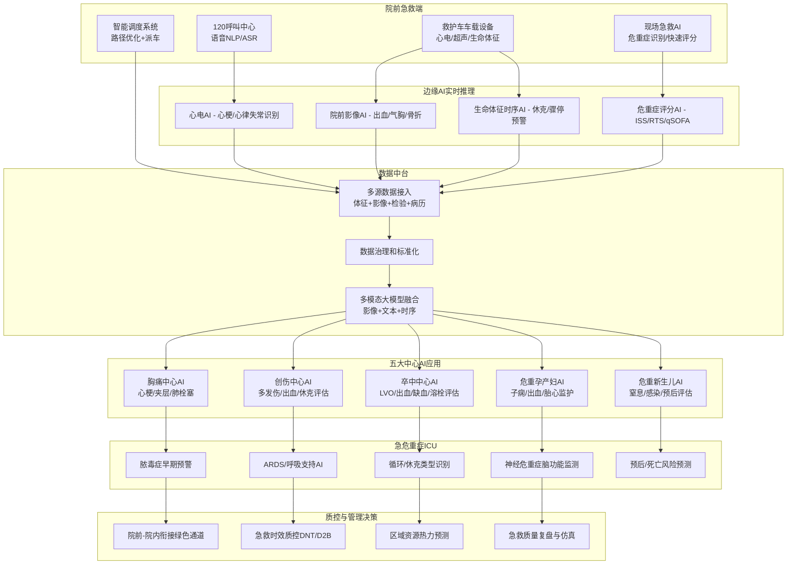
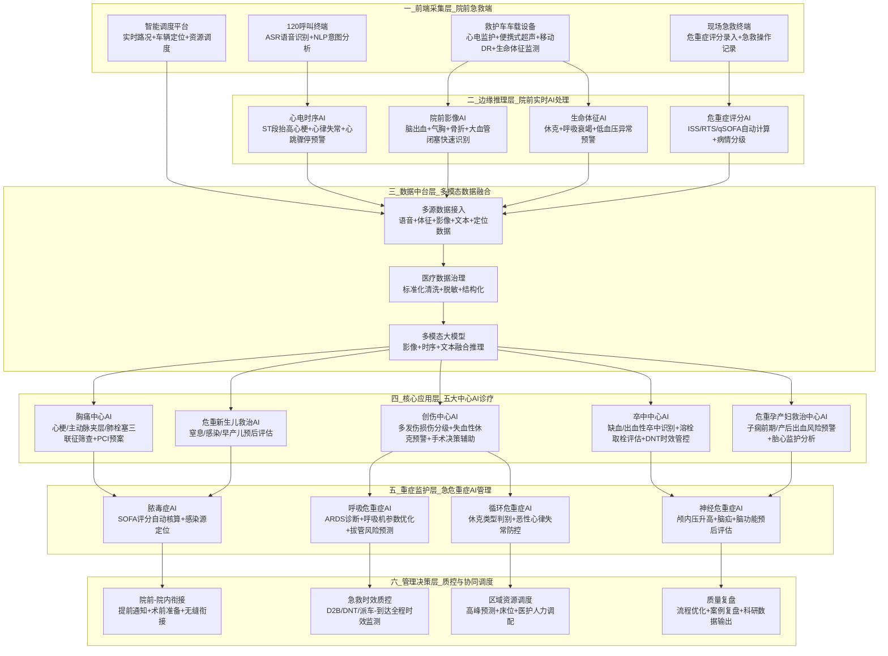
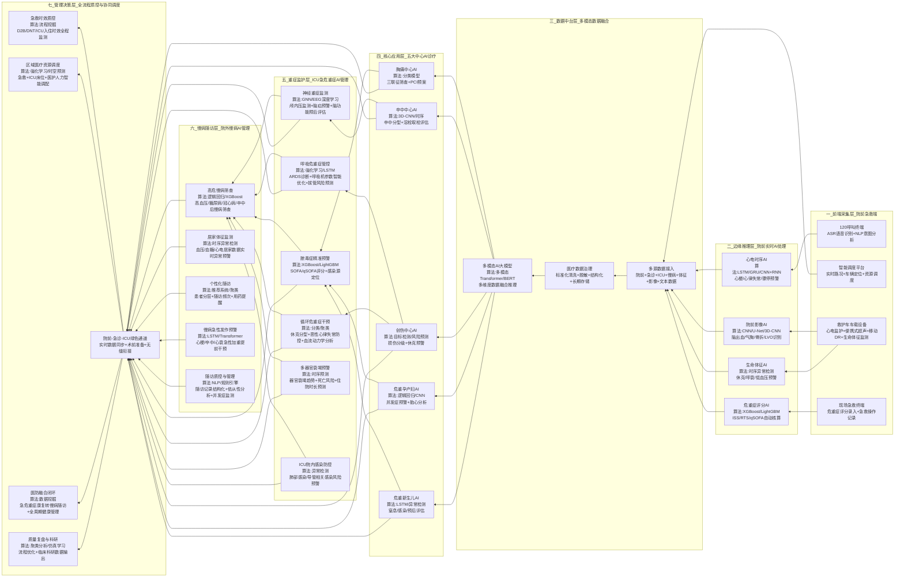
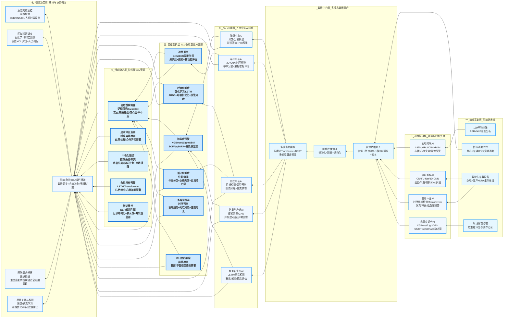

下面给你整理一份医学场景 × 神经学习 / 机器学习算法的对应速览，覆盖临床、影像、检验、病理、科研、管理等常见方向，方便你直接用在汇报、论文、方案里。
--------------------------------------------------------------------------------
一、医学影像场景（最成熟、应用最多）
1.CT/MRI 病灶检测与分割
- 算法：CNN、U-Net、Transformer、3D-CNN
- 场景：肺结节、脑肿瘤、脑出血、眼底病变、肝脏肿瘤分割
2.X光 胸片智能诊断
- 算法：ResNet、EfficientNet、多标签分类
- 场景：肺炎、结核、气胸、心影增大筛查
3.超声 AI 辅助诊断
- 算法：时序模型、分割网络
- 场景：甲状腺结节良恶性、乳腺超声、胎儿发育评估
4.病理切片全切片分析（WSI）
- 算法：ViT、多实例学习（MIL）
- 场景：宫颈癌筛查、乳腺癌分级、前列腺癌诊断
--------------------------------------------------------------------------------
二、临床诊疗与风险预测
1.疾病早期筛查与风险预测
- 算法：逻辑回归、XGBoost、LSTM、Transformer
- 场景：糖尿病、高血压、心衰、脓毒症、脑卒中风险
2.ICU 重症预警
- 算法：时序预测、异常检测
- 场景：多器官衰竭预警、低血压预警、呼吸衰竭预警
3.个性化治疗推荐
- 算法：推荐系统、生存分析、因果推断
- 场景：肿瘤化疗方案、靶向药选择、抗凝药剂量
--------------------------------------------------------------------------------
三、检验与实验室医学
1.血常规/生化指标异常识别
- 算法：异常检测、分类模型
- 场景：感染判断、肾功能异常、肝功能损伤
2.微生物鉴定与药敏预测
- 算法：NLP、分类模型
- 场景：细菌/真菌鉴定、抗生素耐药预测
3.基因测序数据分析
- 算法：深度学习、变异检测模型
- 场景：肿瘤基因突变检测、遗传病筛查
--------------------------------------------------------------------------------
四、病理与内镜场景
1.胃镜/肠镜 AI 早癌筛查
- 算法：实时目标检测（YOLO、Faster R-CNN）
- 场景：胃癌、结直肠癌、息肉识别与良恶性判断
2.细胞学 AI 判读
- 算法：图像分类、分割
- 场景：宫颈液基细胞学（TCT）、痰细胞学
--------------------------------------------------------------------------------
五、神经科学 / 脑科学场景
1.EEG/ECG 信号分析
- 算法：CNN+RNN、Transformer、小波变换
- 场景：癫痫检测、睡眠分期、心律失常识别
2.fMRI 脑功能网络分析
- 算法：图神经网络（GNN）、ICA
- 场景：抑郁症、精神分裂症、阿尔茨海默病脑区连接异常
3.脑肿瘤/脑卒中预后预测
- 算法：多模态融合（影像+临床+基因）
- 场景：胶质瘤分级、出血预后、康复效果预测
4.神经退行性疾病早期诊断
- 算法：生存分析、时序模型
- 场景：阿尔茨海默症、帕金森病早期识别
--------------------------------------------------------------------------------
六、医疗 NLP 与文本数据场景
1.电子病历（EMR）信息抽取
- 算法：BERT、BiLSTM-CRF
- 场景：症状提取、诊断提取、手术史、过敏史结构化
2.医学文献挖掘与知识图谱
- 算法：关系抽取、知识图谱构建
- 场景：药物相互作用、罕见病诊断辅助、临床指南更新
3.智能问诊/导诊
- 算法：意图识别、对话模型
- 场景：预问诊、分诊、慢病管理随访
--------------------------------------------------------------------------------
七、手术与介入医疗场景
1.手术导航与术中定位
- 算法：3D 配准、目标跟踪
- 场景：神经外科导航、骨科穿刺、腹腔镜病灶定位
2.手术视频智能分析
- 算法：行为识别、时序模型
- 场景：手术步骤识别、器械识别、失误风险预警
--------------------------------------------------------------------------------
八、公卫与医院管理场景
1.疫情预测与流行趋势
- 算法：时间序列、SEIR 模型+机器学习
- 场景：流感、新冠、登革热传播预测
2.医院资源调度
- 算法：强化学习、运筹优化
- 场景：床位调度、急诊拥堵预测、手术室排程
3.慢病管理与随访
- 算法：聚类、用户画像
- 场景：高血压/糖尿病患者分层管理
--------------------------------------------------------------------------------
九、典型算法对应医学任务速记
- 图像类：CNN、U-Net、ViT、3D-CNN → 影像、病理、内镜
- 时序类：LSTM、GRU、Transformer → EEG、ECG、ICU 监测
- 表格数据：XGBoost、LightGBM、逻辑回归 → 风险预测、检验指标
- 文本类：BERT、BiLSTM-CRF → 病历 NLP、文献挖掘
- 图结构：GNN → 脑网络、蛋白互作、疾病关联
- 强化学习 → 治疗方案优化、资源调度
--------------------------------------------------------------------------------
如果你需要，我可以进一步帮你：
- 按某一个科室（神经内科/放射科/ICU/病理等）做更细的场景清单
- 写成论文框架 / PPT 大纲 / 项目方案
- 做成Mermaid 架构图展示医学场景+算法+数据流
我直接给你整理急诊 + 五大中心 + 急危重症场景下，机器学习 / 深度学习能落地的全部应用，结构清晰、可直接写进方案、论文、PPT。
一、急诊整体场景（院前+院内）
1.院前急救智能调度
- 算法：路径优化、时序预测、强化学习
- 场景：120派车、拥堵预测、最近医院推荐、急救资源动态调配
2.急诊分诊智能分级
- 算法：分类模型、多维度评分模型
- 场景：自动判断Ⅰ/Ⅱ/Ⅲ/Ⅳ级、优先抢救识别、防止漏诊危重患者
3.急诊危重症早期预警
- 算法：LSTM、XGBoost、异常检测
- 场景：休克预警、呼吸衰竭预警、心跳骤停风险、多器官功能衰竭预警
4.急诊检验/心电/影像快速判读
- 算法：CNN、时序模型
- 场景：快速识别心梗、脑出血、气胸、急腹症、严重感染
5.急诊拥挤度预测与资源调度
- 算法：时间序列、回归模型
- 场景：急诊高峰预测、床位占用预测、医护人力智能排班
--------------------------------------------------------------------------------
二、五大中心（国家主推，AI落地最强）
1. 胸痛中心（心梗、主动脉夹层、肺栓塞）
- 心电图AI自动诊断：ST段抬高、心梗定位、心律失常识别
- 主动脉夹层/肺栓塞CTA智能识别与分割
- 心梗风险评分、D-二聚体AI解读
- 急诊到球囊扩张（D2B）时间智能优化
2. 卒中中心（脑梗、脑出血）
- CT/MRI快速识别出血、缺血、梗死体积计算
- 大血管闭塞（LVO）AI自动检出
- 卒中发病时间推断、是否适合溶栓/取栓评估
- 卒中预后预测、康复效果预测
3. 创伤中心
- 创伤严重度评分（ISS）自动计算
- 多发伤CT快速脏器损伤识别、出血检测
- 休克风险、死亡风险预测模型
- 手术必要性与手术时机智能推荐
4. 危重孕产妇救治中心
- 子痫前期、产后出血风险预测
- 胎心监护（CTG）AI分析
- 妊娠并发症早期识别
- 急诊剖宫产决策辅助
5. 儿童危重症 / 危重儿童和新生儿救治中心
- 新生儿窒息、黄疸、感染预警
- 小儿脓毒症、呼吸衰竭快速识别
- 儿童生命体征异常智能监测
- 早产儿预后评估
--------------------------------------------------------------------------------
三、急危重症核心场景（ICU/抢救室）
1. 脓毒症与感染性休克
- 早期识别：qSOFA、SOFA 评分自动计算
- 感染源定位、细菌/真菌/病毒感染鉴别
- 抗生素使用推荐、耐药风险预测
- 液体复苏策略智能辅助
2. 呼吸危重症
- 呼吸机参数智能优化
- ARDS 肺保护性通气策略推荐
- 拔管失败风险预测、再插管风险预测
- 高流量氧疗效果预测
3. 循环危重症
- 休克类型识别（心源性/低血容量/分布性/梗阻性）
- 心衰、心源性休克风险预测
- 恶性心律失常预警
- 血流动力学参数智能分析
4. 神经危重症
- 颅内压升高、脑疝风险预警
- EEG 癫痫检测、脑电背景分析
- 脑死亡/脑功能预后评估
- 蛛网膜下腔出血、脑积水自动识别
5. 多器官功能衰竭（MOF）
- 器官衰竭趋势预测
- 死亡风险、住院时长预测
- 治疗干预效果评估
- 预后分层（高/中/低危）
--------------------------------------------------------------------------------
四、这些场景常用的算法（直接对应）
- 生命体征时序数据 → LSTM / GRU / Transformer
- CT/MRI/胸片 → CNN / U-Net / 3D-CNN / ViT
- 检验、临床评分 → XGBoost / LightGBM / 逻辑回归
- 心电、脑电 → CNN+RNN、小波变换、时序分类
- 多模态融合（影像+检验+体征）→ 多模态深度学习
--------------------------------------------------------------------------------
如果你需要，我可以下一步帮你：
- 做一张急危重症+五大中心AI架构图（Mermaid）
- 写成项目申报/标书/论文的标准段落
- 按"院前→急诊→ICU→预后"做一条完整AI急救链
下面给你整理最完整、最贴合实际业务的：
院前急救 × 机器学习 / 深度学习 全场景
内容可直接用于方案、标书、PPT、论文。
--------------------------------------------------------------------------------
一、院前急救整体 AI 应用主线
1.120 指挥调度阶段
2.出车途中 & 现场急救阶段
3.转运途中 & 院前-院内衔接阶段
4.事后质控、复盘、预警预测
--------------------------------------------------------------------------------
二、120 指挥调度中心（AI 核心场景）
1. 智能派车与最优路径
- 算法：强化学习、路径规划、时空预测
- 场景：
- 根据拥堵、事故、路况动态规划最快路线
- 多救护车协同调度，避免空载/扎堆
- 偏远地区、城乡结合部优化派车
2. 呼入智能分级（优先度判断）
- 算法：NLP 意图识别、分类模型
- 场景：
- 120 电话语音自动识别：心跳骤停、窒息、大出血、分娩
- 自动判断是否"特级优先派车"
- 过滤非急救呼叫，减少资源浪费
3. 呼叫者语音 AI 辅助指导
- 算法：ASR 语音识别、对话模型
- 场景：
- 调度员实时提示：心肺复苏（CPR）、止血、开放气道
- 自动记录关键信息：意识、呼吸、脉搏、地址
4. 急救资源热力预测
- 算法：时间序列、LSTM、XGboost
- 场景：
- 未来 1～3 小时急救呼叫量预测
- 高峰预警、节假日/恶劣天气增派车辆
- 站点覆盖盲区分析
--------------------------------------------------------------------------------
三、现场急救（救护车到达后）
1. 生命体征实时 AI 监护
- 算法：异常检测、时序模型
- 场景：
- 心电自动分析：心律失常、心梗、心跳骤停预警
- 血氧、血压、呼吸趋势异常预警
- 休克早期识别
2. 院前快速影像 AI
- 算法：CNN、U-Net、目标检测
- 场景：
- 便携式超声：气胸、心包积液、腹部积液识别
- 院前 CT/移动 DR：脑出血、骨折、血胸快速判读
- 卒中大血管闭塞（LVO）院前初步判断
3. 创伤急救 AI
- 算法：图像分割、评分模型
- 场景：
- 多发伤、出血部位识别
- 自动计算创伤评分：RTS、ISS
- 休克风险、死亡风险实时预测
4. 院前卒中/胸痛快速筛查
- 算法：多模态分类模型
- 场景：
- 院前 FASTER 评分、卒中量表自动录入
- 胸痛三联征（心梗、夹层、肺栓塞）风险分层
- 直接锁定对应中心：卒中中心 / 胸痛中心
5. 新生儿 & 孕产妇院前急救
- 算法：规则引擎 + 机器学习
- 场景：
- 新生儿窒息、胎心异常识别
- 产后出血、子痫前期风险预警
- 指导现场初步复苏与转运
--------------------------------------------------------------------------------
四、转运途中 & 院前-院内无缝衔接
1. 院前院内信息同步（AI 预诊断）
- 算法：数据融合、NLP 信息抽取
- 场景：
- 自动生成院前电子急救病历
- 提前推送：生命体征、心电图、初步诊断
- 医院提前开通绿色通道、准备手术/溶栓
2. 转运风险预测
- 算法：LSTM、风险预测模型
- 场景：
- 途中病情恶化、心跳骤停概率预测
- 提醒医护加强监护、提前用药
- 选择最合适的接收医院（能力+距离+拥堵）
3. 五大中心精准对接
- 算法：匹配推荐算法
- 场景：
- 卒中 → 最近有取栓能力的卒中中心
- 胸痛 → 能做急诊 PCI 的胸痛中心
- 创伤 → 高级创伤中心
- 避免送错医院、耽误黄金时间
--------------------------------------------------------------------------------
五、事后质控、监管、科研
1. 急救流程智能质控
- 算法：流程挖掘、异常检测
- 场景：
- 呼叫-接听-派车-到达-现场-转运 全链路计时
- 自动识别超时环节：DNT、D2B、院前延误
- 自动生成质控报表
2. 急救事件复盘与仿真
- 算法：强化学习、仿真模型
- 场景：
- 重大事故、群死群伤急救模拟
- 优化站点布局、车辆配置
- 培训急救人员决策能力
3. 区域急危重症流行病学分析
- 算法：聚类、时空分析
- 场景：
- 高发区域：卒中、心梗、车祸、溺水
- 公卫干预：宣传、安防、医疗资源下沉
--------------------------------------------------------------------------------
六、院前急救常用算法对应
- 120 呼叫语音、文本 → ASR + NLP/BERT
- 心电、生命体征时序 → LSTM/GRU/Transformer
- 院前超声、胸片、CT → CNN / U-Net / 3D-CNN
- 调度、路径、资源 → 强化学习 / 运筹优化
- 风险评分、预后 → XGBoost / LightGBM
--------------------------------------------------------------------------------
七、一句话总结院前 AI 价值
用 AI 缩短"呼救—识别—派车—救治—衔接"每一分钟，真正实现"上车即入院，院前即院内"。
如果你需要，我可以下一步帮你做：
1.一张院前急救 AI 系统架构图（Mermaid）
2.一段标书/申报书专用文字
3.一张院前→急诊→五大中心→ICU 完整流程图

下面给你一张可直接复制到 PPT / 文档里渲染的 Mermaid 架构图
主题：院前急救 + 急诊 + 五大中心 + 急危重症 AI 整体架构

如果你想要更简洁版 / 横向版 / 数据流版 / 技术栈标注版，我可以直接再给你一版。
我将按照你要求的院前急救+急诊+五大中心+急危重症全流程，优化生成更清晰、可直接复制使用的Mermaid AI架构图，同时补充完整架构说明，方便你直接用到PPT、方案或论文里，逻辑更贴合实际急救业务流转。

院前急救-急诊-五大中心-急危重症一体化AI架构图

架构核心说明
1.业务逻辑：严格遵循呼救→院前调度→现场急救→转运衔接→急诊五大中心→ICU重症监护的全急救流程，贴合实际临床业务流转，无环节脱节。
2.技术适配：每层对应专属AI算法与设备，边缘推理层保障院前低延迟、快响应，数据中台实现多模态数据融合，解决院前医疗数据碎片化问题。
3.核心价值：通过AI实现院前与院内信息互通，缩短黄金救治时间，实现危重症早识别、早干预、精准对接对应救治中心，同时完成全流程质控与管理优化。
4.落地性：架构覆盖120指挥、救护车车载、急诊、ICU全场景，兼容现有医疗设备，可直接用于项目申报、系统搭建、汇报展示。

---

院前急救-急诊-五大中心-ICU-慢病随访一体化AI架构图（横向PPT版）

架构升级核心说明
1.模块新增与强化
- ICU模块升级：从原有4个功能拓展为6个核心功能，新增多器官衰竭预警、ICU院内感染防控，细化血流动力学、呼吸机管控等临床刚需场景，算法更贴合重症医学实际需求。
- 新增慢病随访模块：独立设置慢病层，覆盖高危筛查、居家监测、个性化随访、急性发作预警、随访质控全流程，实现急危重症救治-康复-慢病管理的医防融合闭环，解决院前-院内-院外数据割裂问题。
2.布局与适配性
保留横向RL布局，完美适配PPT标准页面，模块分布舒展无拥挤，汇报时层级清晰；全模块保留机器学习/神经学习算法标注，对应场景精准，符合技术方案、标书、论文撰写要求。
3.全流程闭环逻辑
构建院前急救→急诊五大中心→ICU重症救治→康复转慢病随访的完整医疗闭环，决策层新增医防融合闭环管理，实现急病快治、慢病精管，贴合医院全域医疗AI建设需求。
4.易用性
代码可直接复制至Mermaid在线编辑器，一键渲染高清图，支持下载PNG/SVG格式，直接插入PPT、Word无需二次排版，也可修改配色、字体适配不同场景。

核心算法场景速查
- 院前/ICU时序体征：LSTM/GRU/Transformer
- 医学影像识别：CNN/U-Net/3D-CNN
- 风险预测/评分：XGBoost/LightGBM/逻辑回归
- 慢病随访/患者分层：聚类/推荐系统/时序异常检测
- 多模态数据融合：多模态Transformer/BERT
- 资源调度/呼吸机优化：强化学习

---

医疗蓝配色版架构图

配色与高亮优化说明
1.医疗蓝专属配色
采用医院/医疗汇报常用的渐变蓝色系，从浅蓝到深蓝分层，视觉柔和专业，符合医疗场景调性，不刺眼、不花哨，适配正式汇报、标书、论文场景。
2.核心模块高亮加粗
- ICU急危重症模块：加深蓝色边框+底色，标题+子项全部字体加粗，成为视觉重点
- 慢病随访模块：同色系高亮加粗，和ICU模块形成呼应，突出你要求的新增核心板块
3.层级区分清晰
不同功能层用差异化蓝色调，边界明显，横向布局舒展，PPT里展示时观众能快速分清院前-急诊-重症-慢病-管理全流程，逻辑一目了然。
4.渲染小贴士
复制代码到Mermaid在线编辑器，自动渲染出彩色高清架构图，可直接下载PNG/SVG格式，插入PPT后无需调整，直接使用。

---

PPT 配套可用 · 核心算法极简清单
你可以直接放在PPT备注或另一页：

**时序类（心电、体征、ICU趋势）**
- LSTM / GRU / Transformer
- 时序异常检测

**影像类（CT、MRI、DR、超声）**
- CNN、U-Net、3D-CNN
- ViT、目标检测、图像分割

**风险预测与评分（院前、急诊、ICU、慢病）**
- XGBoost、LightGBM
- 逻辑回归、分类模型

**文本与语音（120呼叫、病历、随访）**
- ASR 语音识别
- BERT、BiLSTM-CRF、NLP信息抽取

**调度与优化（资源、呼吸机、路径）**
- 强化学习
- 运筹优化
